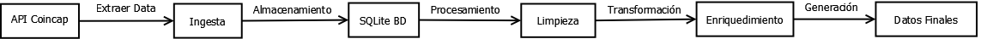
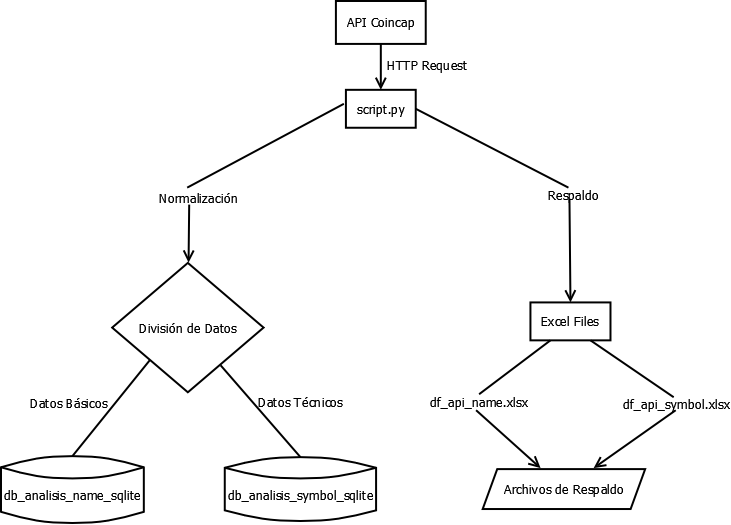
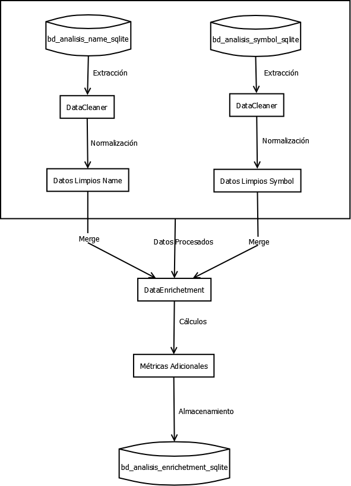
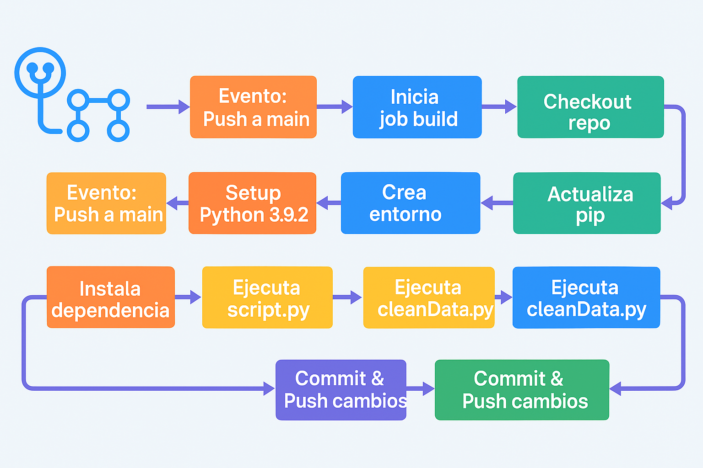
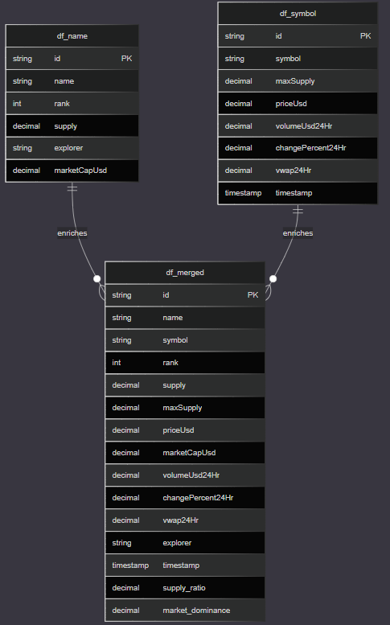

# bigdata20251_actividad1
# Simulación de Entorno Big Data para Análisis de Criptomonedas

Este proyecto implementa una simulación de un entorno Big Data para el análisis de datos de criptomonedas, utilizando bases de datos SQLite como simuladores de datos en la nube.

## Arquitectura General

El proyecto está estructurado en tres fases principales que procesan datos de criptomonedas obtenidos de la API de CoinCap:

- **Ingesta de Datos**
- **Preprocesamiento y Limpieza**
- **Enriquecimiento de Datos**

## Componentes Críticos

### Bases de Datos Analíticas

- **bd_analisis_name.sqlite**: Almacena información básica de criptomonedas (ID, nombre, rango, suministro)
- **bd_analisis_symbol.sqlite**: Almacena datos técnicos (símbolo, precio, volumen, cambios)
- **bd_analisis_enriched.sqlite**: Contiene los datos después del proceso de enriquecimiento

### Scripts de Procesamiento

#### 1. Ingesta (script.py)

- Obtiene datos de la API de CoinCap
- Divide los datos en dos conjuntos (name y symbol)
- Almacena los datos en las bases SQLite correspondientes
- Genera archivos Excel para respaldo

#### 2. Limpieza (cleanData.py)

- Implementa la clase DataCleaner
- Maneja la normalización de datos
- Realiza conversiones numéricas
- Limpia valores nulos y estandariza formatos

#### 3. Enriquecimiento (enrichment.py)

- Implementa la clase DataEnricher
- Combina datos de ambas bases de datos
- Agrega métricas calculadas
- Genera reportes de enriquecimiento

## Flujo de Datos



## Diagramas del Sistema

### 1. Flujo de Extracción y Almacenamiento de Datos



### 2. Proceso de Limpieza y Enriquecimiento



### 2. Automatizacion GitHubActions



### Descripción de los Procesos

1. **Flujo de Extracción**:

   - La API de CoinCap es consultada por `script.py`
   - Los datos son normalizados y divididos en dos conjuntos
   - Se almacenan en bases SQLite separadas
   - Se generan archivos Excel de respaldo

2. **Proceso de Limpieza y Enriquecimiento**:
   - El `DataCleaner` procesa los datos de ambas bases
   - Se realiza la normalización y limpieza
   - El `DataEnricher` combina los datos limpios
   - Se calculan métricas adicionales
   - Los datos enriquecidos se almacenan en la base final

## Modelo de Datos

### Estructura de Bases de Datos

#### 1. bd_analisis_name.sqlite

**Tabla: df_name**

```sql
CREATE TABLE df_name (
    id TEXT PRIMARY KEY,
    name TEXT NOT NULL,
    rank INTEGER,
    supply DECIMAL(20,8),
    explorer TEXT,
    marketCapUsd DECIMAL(20,8)
);
```

#### 2. bd_analisis_symbol.sqlite

**Tabla: df_symbol**

```sql
CREATE TABLE df_symbol (
    id TEXT PRIMARY KEY,
    symbol TEXT NOT NULL,
    maxSupply DECIMAL(20,8),
    priceUsd DECIMAL(20,8),
    volumeUsd24Hr DECIMAL(20,8),
    changePercent24Hr DECIMAL(20,8),
    vwap24Hr DECIMAL(20,8),
    timestamp TIMESTAMP
);
```

#### 3. bd_analisis_enriched.sqlite

**Tabla: df_merged**

```sql
CREATE TABLE df_merged (
    id TEXT PRIMARY KEY,
    name TEXT NOT NULL,
    symbol TEXT NOT NULL,
    rank INTEGER,
    supply DECIMAL(20,8),
    maxSupply DECIMAL(20,8),
    priceUsd DECIMAL(20,8),
    marketCapUsd DECIMAL(20,8),
    volumeUsd24Hr DECIMAL(20,8),
    changePercent24Hr DECIMAL(20,8),
    vwap24Hr DECIMAL(20,8),
    explorer TEXT,
    timestamp TIMESTAMP,
    supply_ratio DECIMAL(20,8),
    market_dominance DECIMAL(20,8)
);
```

### Diagrama del Modelo de Datos



### Descripción de las Relaciones

1. **Relación entre Tablas**:

   - Las tablas `df_name` y `df_symbol` se relacionan a través del campo `id`
   - Ambas tablas contribuyen datos a la tabla final `df_merged`
   - La relación es de tipo uno a uno, donde cada criptomoneda tiene un registro en cada tabla

2. **Campos Calculados en df_merged**:

   - `supply_ratio`: Relación entre supply y maxSupply (indica qué porcentaje del suministro máximo está en circulación)
   - `market_dominance`: Porcentaje que representa la capitalización de mercado de la criptomoneda en relación al total

3. **Tipos de Datos**:

   - Uso de DECIMAL(20,8) para valores financieros precisos
   - TEXT para identificadores y nombres
   - TIMESTAMP para marcas temporales
   - INTEGER para rankings y conteos

4. **Integridad Referencial**:
   - El campo `id` actúa como clave primaria en todas las tablas
   - Se mantiene la consistencia de datos entre las tablas mediante el proceso de enriquecimiento

## Características Destacadas

- **Modularidad**: Cada fase está en scripts separados
- **Trazabilidad**: Sistema de logging y auditoría
- **Flexibilidad**: Configuración mediante diccionarios
- **Respaldo**: Generación de archivos Excel y reportes TXT

## Mecanismo de Automatización

- Scripts Python independientes pero interconectados
- Implementación de manejo de errores y logging
- Generación de reportes de auditoría en cada fase
- Procesos ejecutables secuencialmente o de forma independiente
